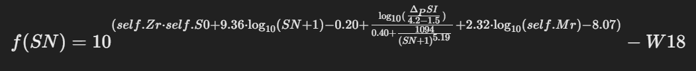

# Learning about my project

## Section 1

The program, in the first part, calculates the value of W18 or the number of equivalent single axle loads of 8.2 tons in the design lane during the design period. This is done by entering parameters such as reliability, standard deviation, structural number, delta of the pavement serviceability index, and the resilient modulus of the material composing the pavement layer.

## Section 2
The other part calculates the value of the structural number by solving the equation using the numerical Newton-Raphson method to find the root of the following displayed equation.

